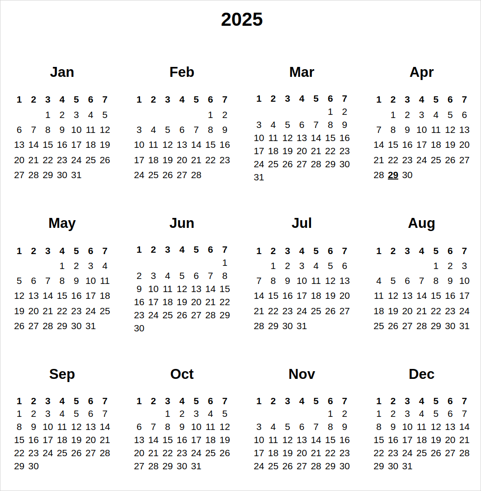

# bcal.sh - generate html calendar using only bash
You want to check out a calendar, but you have only your browser and bash? -- It's not a problem!



Just run
```
./bcal.sh 
```
and check out `<CURRENT_YEAR>.html` file in your browser!

Docs:
```
bcal - generate calendar in html
usage: bcal [FILE] [-h] [-y YEAR] [-x8, -x16]
generates html file FILE with table calendar of current year or YEAR, if specified.
if FILE is not specified, outputs to <CURRENT_YEAR>.html
use -h to print this page, -x8 and -x16 enable secret display mode :)
```

Done within Tagd_Tagd bash course, thank you all!
